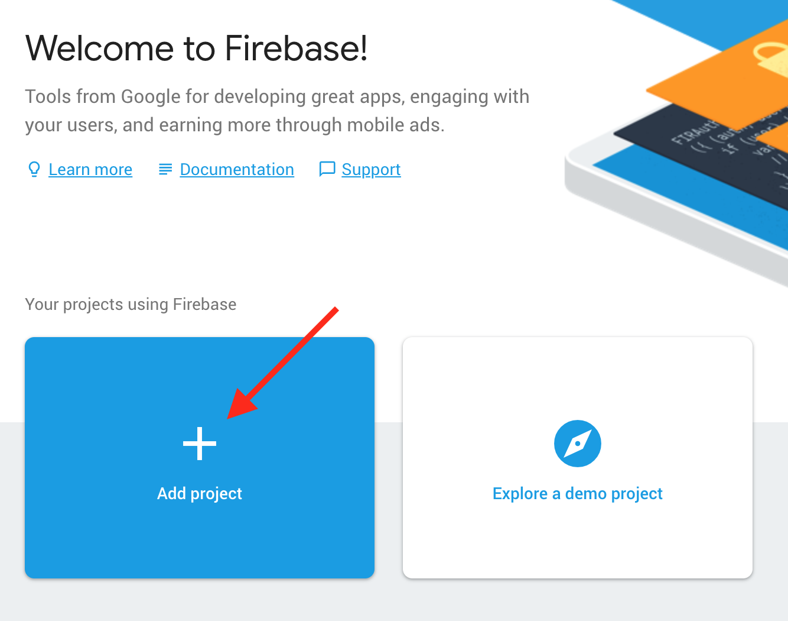
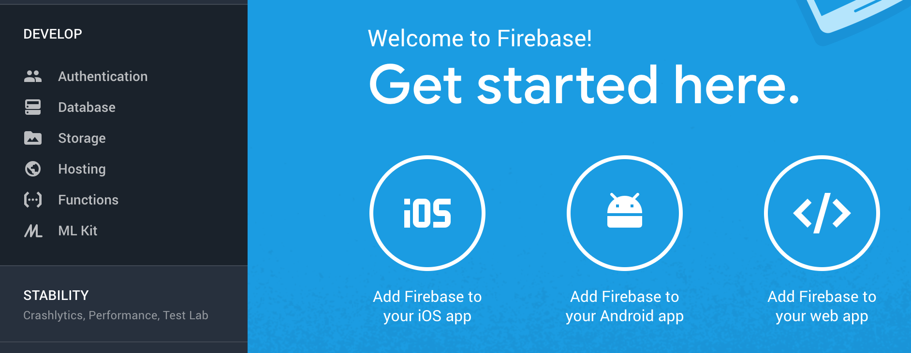
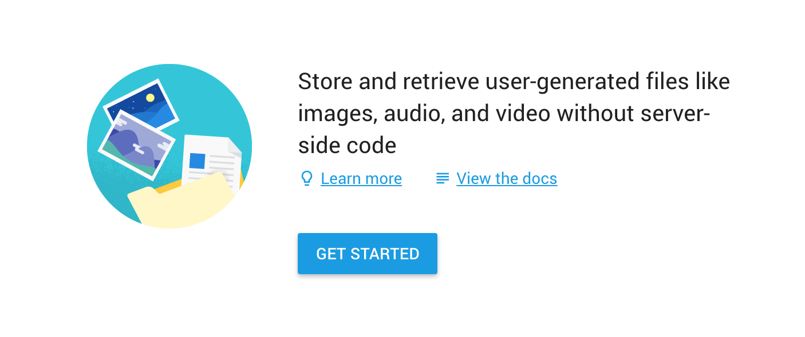
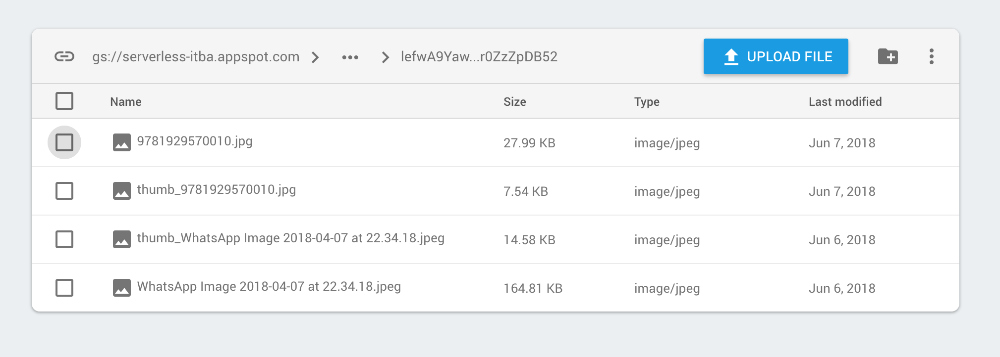
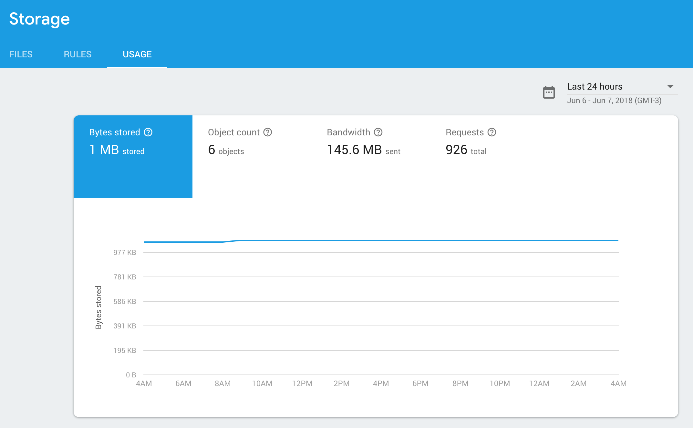
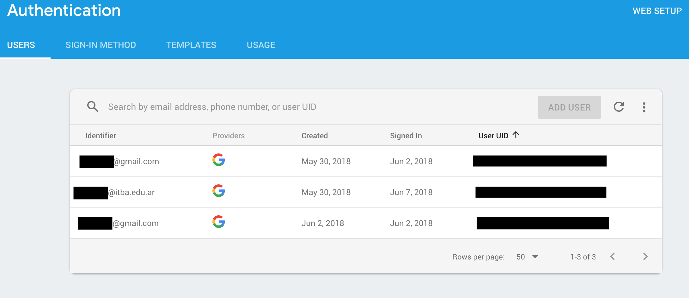
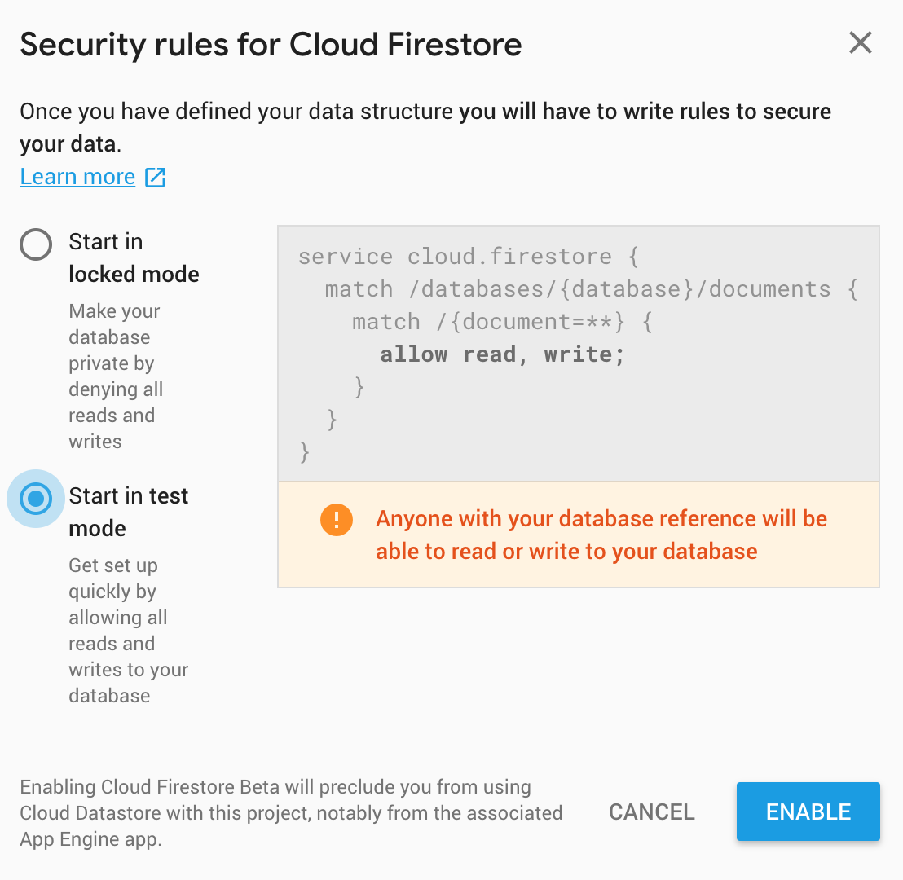
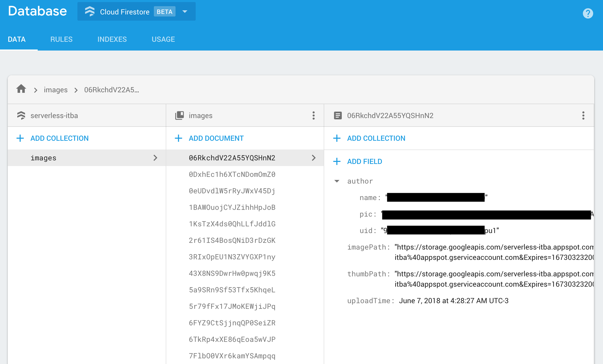
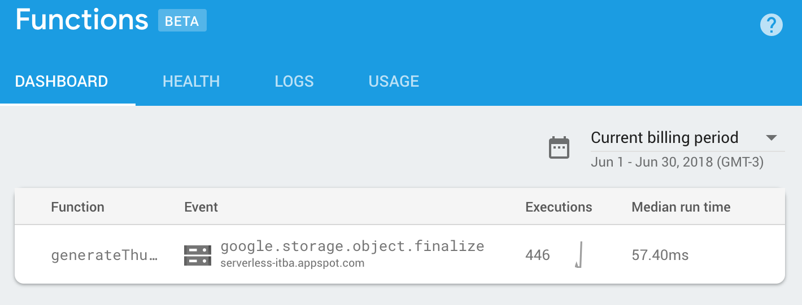
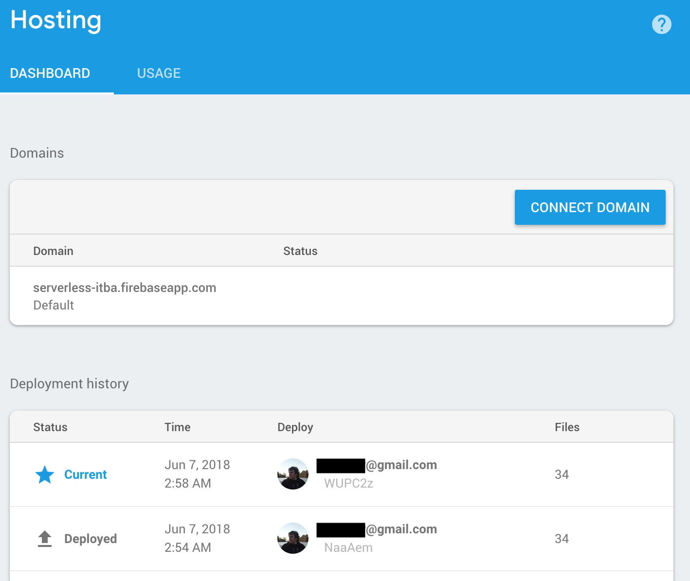

# Firebase: Getting started

Firebase is a service that works on top of [Google Cloud](https://cloud.google.com/) to bring the benefits of serverless architecture to the end-user, so that they don't have to worry about managing or scaling servers and can focus on the problem at hand.

## Table of contents

- [Prerequisites](#prerequisites)
  - [Firebase Registration](#firebase-registration)
  - [Firebase project creation](#firebase-project-creation)
  - [Firebase services configuration](#firebase-services-configuration)
    - [Firebase Storage](#firebase-storage)
    - [Firebase Authentication](#firebase-authentication)
    - [Firebase Database](#firebase-database)
    - [Firebase Functions](#firebase-functions)
    - [Firebase Hosting](#firebase-hosting)
  - [Web application configuration](#web-application-configuration)
- [CLI tools installation](#cli-tools-installation)
  - [Firebase files](#firebase-files)
- [Firebase functions development](#firebase-functions-development)
- [Firebase deploy](#firebase-deploy)

## Prerequisites

### Firebase Registration

In order to get firebase working, we first need to register an account with them. This can be done from the following address:

https://firebase.google.com/

### Firebase project creation

- Once an account has been created, we need to go to the _console_ by clicking on the _GO TO CONSOLE_:


- Once in the console, we proceed to create a new project:



- Choose a project name (don't worry about duplicates since Firebase can handle them) and choose the Country/region that you reside in (this has nothing to do with where Google will host the services).

### Firebase services configuration

Once a project has been created, you'll be presented with a dashboard that contains all of the services that Firebase offers, along with a few useful links to help you setup your project.



For the sake of this project, we'll show how to configure the web client for Firebase, along with the console tools used to work and deploy Firebase features.

#### Firebase Storage

Upon selecting **Storage** in the sidebar, we are presented with an initial screen that lets us read about what this service offers, access to the documentation and a _Get started_ link.



Currently, pressing the _Get started_ link, gives an alert showing that by default, _Storage_ is configured to only allow authorised users to read or write to our _Storage_ instance.

Note: For our use-case, we decided that this was too restrictive, since we wanted anonymous users to have read access to the files, so we ended up modifying this default.

Firebase presents us with a screen that shows the state of our storage _bucket_. Here, we can:

- Upload files
- Download files
- Delete files
- Create directories



Also here we can access the _Rules_ for our Storage service has configured and usage information, such as how much bandwith was used, how many requests we had and how many files were created for any given period of time.



#### Firebase Authentication

The _Authentication Service_ provides a similar Getting started screen as the _Storage Service_, but upon entering this service, we can see that what we are presented is quite different.

From here, we'll be able to:

- Choose what types of Authentication mechanisms we'll want to enable for our application
- Customize certain aspects of:
  - user registration
  - password reset
  - email server settings
  - etc.
- See every user that has registered through Firebase
- Enable or disable registered users



#### Firebase Database

Firebase offers two database services: _Realtime Database_ and _Cloud Firestore_. For this project we'll focus on the latter.

As with _Storage_, once we press the _Get started_ button, we are prompted about the default security rules to use with our database. There are two defaults presented, one is specifically focused for development purposes by allowing read and writes no matter their authentication status and the other one is **strict**, meaning that reads and writes are disabled. This last option is intended to be built upon so that you only allow reads or writes to specific resources for specific users.



Once we get passed the security prompt, we are greeted by the _Firestore_ dashboard:



Here we can:

- View the current state of our document database
- Create/Edit/Delete database records
- Manage our security rules
- View database usage
- Create/Edit/Delete database indexes

#### Firebase Functions

In the _Functions_ section, we can get all of the information relevant to each of the cloud functions defined such as:

- List of enabled functions along with the specified trigger
- Health (amount of errors, performance issues, etc)
- Logs (anything logged from within our functions get displayed here)
- Usage (function invocation for any given period of time)



#### Firebase Hosting

Firebase hosting sections handles everything related to the static-website hosting service. In here you can see a list of past releases as well, manage the domain that your website will use and see the bandwith usage for a certain period of time.



### Web application configuration

To be able to use each of the services configured previously, we need to retrieve the configuration block for our project. This block will be used to initialize the Firebase web client so that it correctly uses all of our services.

For us to be able to get this file, we'll go to the _Firebase Project Overview_ and click the _Add Firebase to your web app_ button.

Upon clicking the button, we are presented with a screen that shows us the configuration block required, as well as presents us with some links that will help us configuring the Firebase client:

```html
<script src="https://www.gstatic.com/firebasejs/5.0.4/firebase.js"/>
<script>
  // Initialize Firebase
  var config = {
    apiKey: "...",
    authDomain: "serverless-itba.firebaseapp.com",
    databaseURL: "https://serverless-itba.firebaseio.com",
    projectId: "serverless-itba",
    storageBucket: "serverless-itba.appspot.com",
    messagingSenderId: "..."
  };
  firebase.initializeApp(config);
</script>
```

That snippet is the general way to add Firebase to a web page, but since we are using React, which supports ES6 Javascript, we'll do it a bit differently:

```javascript
import firebase from "firebase/app";
/* We need the following imports since they have side-effects
 * on the global firebase object and add the required functionality to it
*/
import "firebase/auth";
import "firebase/firestore";
import "firebase/storage";

const config = {
  apiKey: "...",
  authDomain: "serverless-itba.firebaseapp.com",
  databaseURL: "https://serverless-itba.firebaseio.com",
  projectId: "serverless-itba",
  storageBucket: "serverless-itba.appspot.com",
  messagingSenderId: "..."
};

firebase.initializeApp(config);
```

Once that code is run, we'll be able to access each of the imported services without the need for specialized code:

```javascript
firebase.firestore().ref().child("images")...;
// ...
firebase.auth().signInWithRedirect(...)
    .then(result => {...})
    .catch(error => {...});
```

## CLI tools installation

For us to be able to deploy Firebase security rules, services configuration, static website or functions, we'll need to install the `firebase-tools` javascript package.

This requires either _Yarn_ or _NPM_ to be installed.

```bash
npm install -g firebase-tools
```

Once the tools are installed, we need to login to Firebase so that we have deploy permissions:

```bash
firebase login
```

After we are logged in, it's time to initialize Firebase so that it can create every directoy and file it needs for the services we have configured. The following command will prompt us with a series of questions in order to better suit our specific project:

```bash
firebase init
```

After initializing Firebase, we need to specify which project we'll use, to do this, we run the following command with the project id as an argument:

```bash
firebase use serverless-itba
```

Now we are ready to develop and deploy

### Firebase files

Firebase will create the following files:

- `storage.rules` Contains Storage security rules
- `firestore.rules` Contains Firestore security rules
- `database.rules.json` Contains database security rules
- `firestore.indexes.json` Contains Firestore index definitions
- `public/` Files under this directory will be deployed to Firebase Hosting
- `functions/` Files under this directory will be deployed to Firebase Functions
  - All of our cloud functions will be defined inside here
- `firebase.json` Contains settings for each of the services, such as pre and post deploy scripts and configuration (rules/indexes) mapping for each service.

## Firebase functions development

For this project, we chose to develop Firebase functions using _Typescript_. Since no browser runs _Typescript_, there are some extra steps that the Firebase CLI tools do automatically for us to transpile the Typescript code to Javascript.

Function code is implemented inside the `functions/src/` folder.

In the `index.ts` file we add an include guard that only imports the _generateThumbnail_ function if it wasn't imported previously.

In the `generateThumbnail.ts` file is where the cloud function is defined.

Here we import the required Firebase libraries:

```typescript
import * as functions from "firebase-functions";
import * as admin from "firebase-admin";
// Utility imports to do image and file path manipulation
import * as path from "path";
import * as sharp from "sharp";
```

Once we have `functions` imported, we can start defining each of our functions using any of the available triggers (HTTP, Storage, etc.)

An example of this is:

```typescript
/**
 * Trigger for our storage service that is called
 * whenever a file finished uploading, passing to our
 * callback function the object that was added along
 * with metadata such as bucket that received the file,
 * file name, file content type, etc.
*/
functions.storage.object().onFinalize(object => {...})
```

You can see the whole implementation in [generateThumbnail.ts](functions/etc/src/generateThumbnail.ts)

## Firebase deploy

Once we have finished creating cloud functions, defining security rules, database indexes, etc., we are ready to do our first deploy.

The basic way to deploy to firebase is by running the following command:

```bash
firebase deploy
```

That function will deploy the configuration files along with the required files for all of our configured services. Meaning that it will:

- Deploy our static website residing inside the `public` directory
- Deploy all of our functions inside the `functions` directory
- Update security rules for the database and storage

If you don't want to deploy everything, `firebase deploy` allows you to specify which services you want to deploy:

```bash
firebase deploy --only hosting
```
