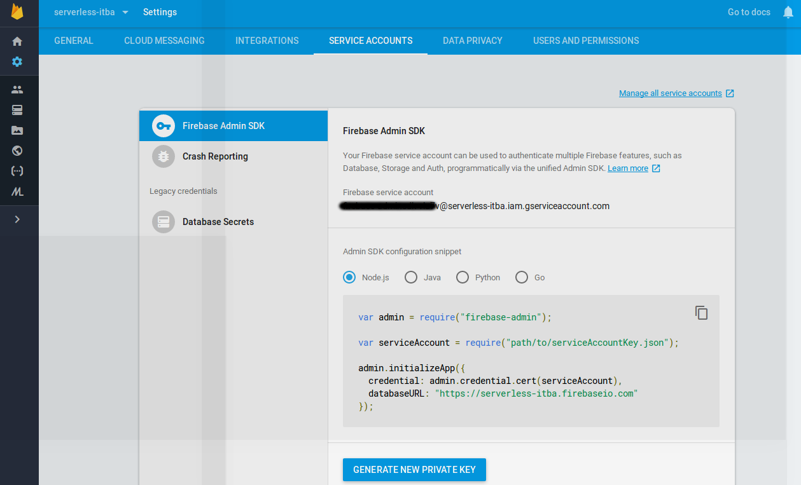
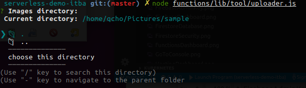
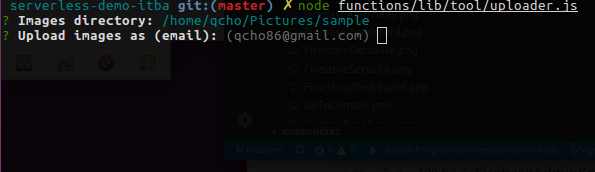
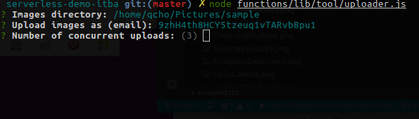
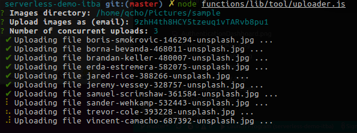

# Uploader script

As part of this special assignment an script that will upload several images at once was added.

The idea behind this script is that it will ask in name of what user do you want to perform the upload, the images directory you want to process and lastly the amount of concurrent uploads you want to have.

Since the tool runs as admin you need to place proper credentials for the tool to run. For that you need to place the `serviceAccountKey.json` along with the `<BUILD_PATH>/tool/uploader.js` file, where `<BUILD_PATH>` is the directory where the `Typescript` functions are compiled.

To obtain the `serviceAccountKey.json` you need to login to the [Firebase Console](https://console.firebase.google.com/), enter into the project > Settings > Project Settings > Service Accounts (tab) > Firebase Admin SDK (menu) > Click on `GENERATE NEW PRIVATE KEY`:

Now you can run `uploader.js`

